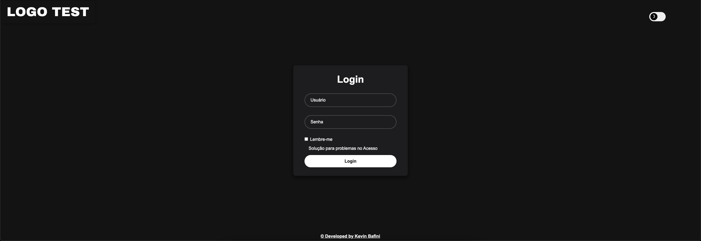
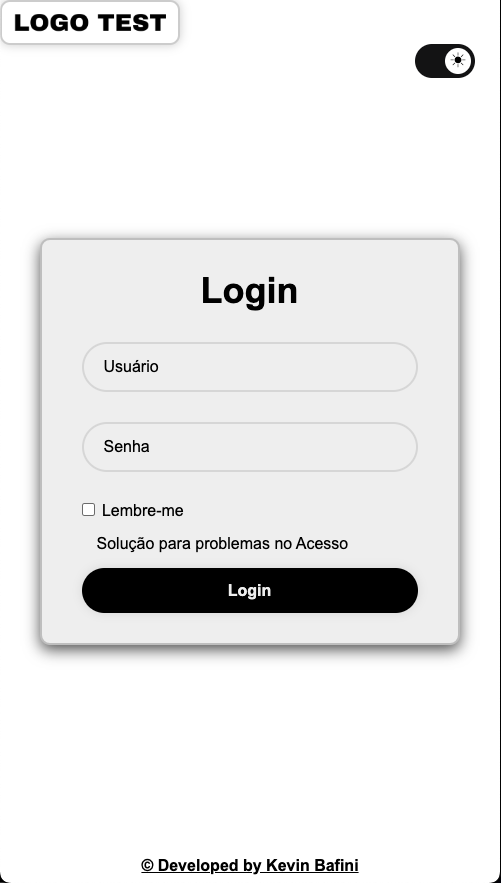

<h1 align="center">Projeto Tela de Login
</h1>

<p align="center">Este é um projeto de tela de login responsivo, que inclui um sistema de troca de temas (claro e escuro). Ele foi desenvolvido para fornecer uma interface de usuário elegante e funcional, adequada para diferentes dispositivos e resoluções de tela.
</p>

## Recursos:

- **Responsividade**: A tela de login ajusta-se a diferentes tamanhos de tela, desde dispositivos móveis a desktops.
- **Troca de Temas**: Possui um toggle para mudar entre tema claro e tema escuro.
- **Imagens Dinâmicas**: Logotipos que mudam conforme o tema selecionado.
- **Validação de Formulário**: Entradas de usuário para login são validadas no front-end.

## 🛠 Tecnologias

As seguintes ferramentas foram usadas na construção do projeto:

- HTML5
- CSS3 
- JavaScript 

<h2 align="center">✅ Demonstração da aplicação</h2>


<br>
<h3 align="center"> Demonstração aplicada no Computador</h3>

<div align="center">

</div>

<br>

<h3 align="center"> Demonstração aplicada no Smartphone</h3>

<div align="center">

</div>

## Instalação

Para executar este projeto localmente, siga estes passos:

- Clone o repositório para sua máquina local:

```bash
https://github.com/Kevinbafini/primary_shop.git
```

Isso criará uma cópia local do repositório em sua máquina.

Se você não tem o Git instalado, você pode baixar o projeto diretamente como um arquivo ZIP através do GitHub e descompactá-lo no diretório de sua escolha.

- Navegue até o diretório do projeto:

Após clonar ou descompactar o repositório, use o terminal ou o explorador de arquivos para navegar até o diretório do projeto.

## Suporte a Navegadores
Este projeto é melhor visualizado nos seguintes navegadores:

- Google Chrome (Versão mais recente)
- Mozilla Firefox (Versão mais recente)
- Safari (Versão mais recente)
- Microsoft Edge (Versão mais recente)
<br>
Certifique-se de estar usando a versão mais atualizada do navegador para a melhor experiência.

## Autor

<h3 font-weight: 900;>Feito por Kevin Bafini</h3>


[](https://www.linkedin.com/in/kevinbafini/)
[](https://www.instagram.com/kevin_bafini12/)
[](https://github.com/Kevinbafini)
